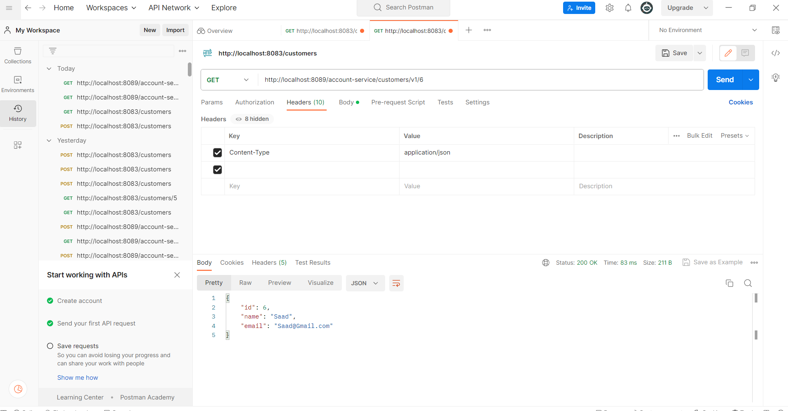

<H1  style="text-align:center"> Customer Rest Service Using Three Different Methods </H1>
<H3>- Client OpenFeign</H3>
<H2>Get All Customers</H2>

<H2>Get Customer By ID</H2>

<H2>Add New Customer </H2>

<H3>- Client Rest Template</H3>
<H2>Get All Customers</H2>

<H2>Get Customer By ID</H2>

<H2>Add New Customer </H2>

<H3>- Client Web Flux</H3>
<H2>Get All Customers</H2>

<H2>Get Customer By ID</H2>

<H2>Add New Customer </H2>

